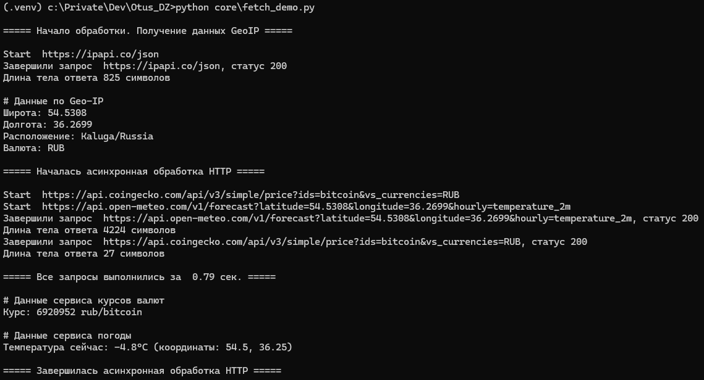

# Домашнее задание:

Используется три сервиса
1. Получает данные по IP, в т.ч. страну, город, валюту, координаты (широта, долгота). Запрос к данному сервису выполняется до gather, чтобы получить требуемые исходные данные.
2. Сервис получения сведений о погоде (использует координаты из п. 1)
3. Сервис получения курса валюты к биткоину (использует идентификатор валюты из п.1)
Сервисы 2 и 3 запускаются через gather

Скрин запуска

# Планы на будущего ИИ-агента
[Пока идеи, могут меняться]
1. Личный помощник (личные финансы, планы, база знаний, напоминания)
2. Бот-консультант по созданию бренда и развитию бизнес-проектов
